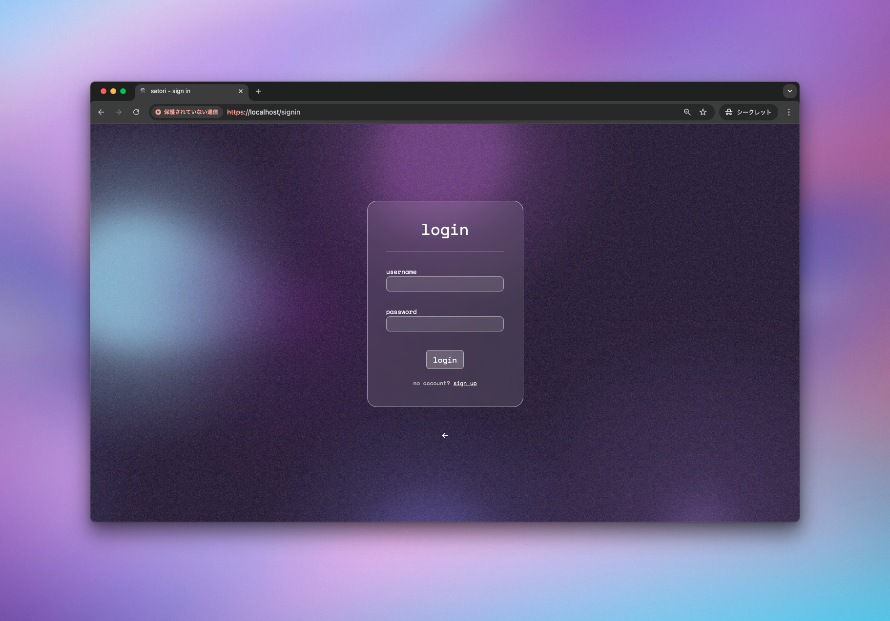
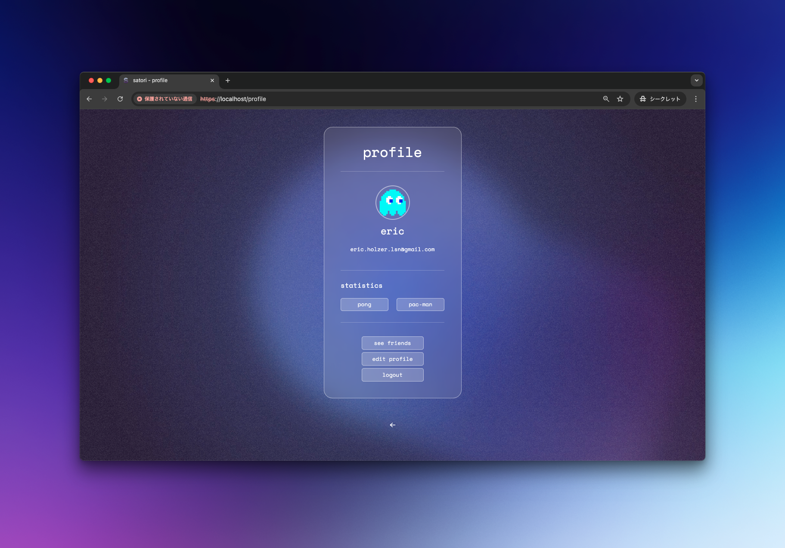
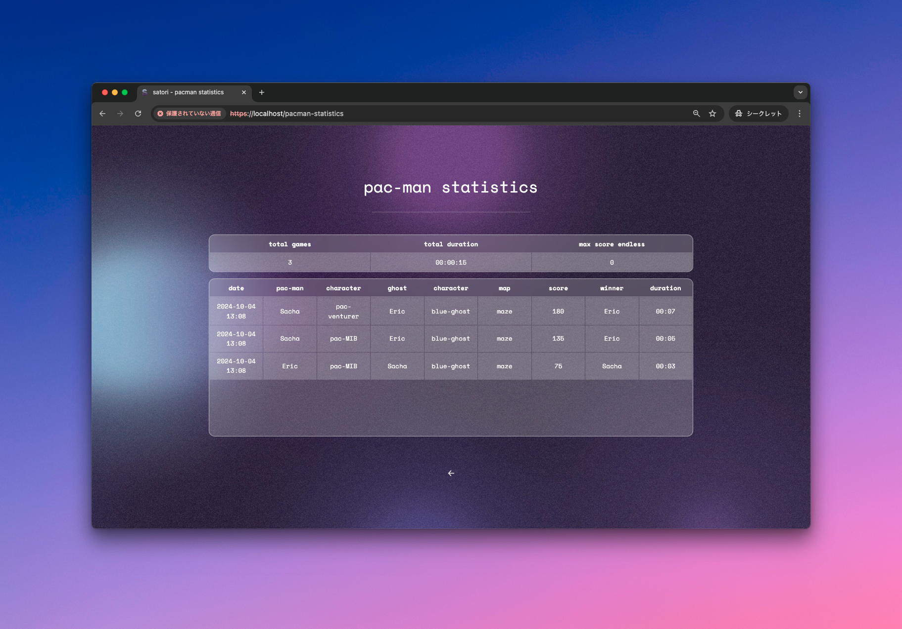

# satori

**ft_transcendence** is our final project of **42 Lausanne**. It is an arcade-like website, we called **satori**, that brings together a **Pong** game, a 2-player **Pac-Man** game, and a variety of additional features such as **3D graphics, an AI opponent, user authentication and game statistics**. Particular emphasis was placed on delivering a **high-quality user experience** through a **modern-looking polished aesthetic**, prioritizing **accessibility, multi-language support, and a fully responsive interface**.


## Features & Tech Stack

- **Modern Frontend**: A rich UI designed with **Bootstrap** and custom **CSS/SCSS**, providing a polished aesthetic.
- **Django Backend**: A powerful framework for handling server-side logic, user authentication, and API development.
- **PostgreSQL Database**: A secure and reliable relational database for managing user profiles, game stats, and history.
- **Authentication System**: User registration, login, profile management, and game history tracking.
- **Pong Game**: 
  - **1v1 Mode**: Compete with friends or against an AI.
  - **Tournaments**: Create tournaments to play with friends.
  - **3D Graphics**: Enhanced visuals powered by **Three.js** for a modern gaming feel.
- **2-Player Pac-Man Game**:
  - **Character Selection**: Choose from different characters with unique abilities.
  - **Multiple Maps**: Navigate various challenging maps.
- **Responsive & Accessible Design**: Optimized UI for desktops, tablets, and mobile devices, with features like keyboard navigation and adjustable settings.
- **Multi-language Support**: Available in multiple languages to cater to global users.
- **Docker & Makefile**: Utilize Docker for containerized deployment and a Makefile for simplifying project launch and management.

## Games

### Pong
The prerequisite for this project was to recreate **Pong** using Javascript. We developed a **Pong** game that fits the website's aesthetic while maintaining the basic **Pong** mechanics. 
An AI opponent is available with two difficulty levels, and we created an **enhanced** game style that adds an active skill and new physics.
A 3D version of the basic **Pong** was also developed to allow users to enjoy the game from new perspectives.

### Pacman
This game has the appearance of the classic **Pacman** but functions as a **catch** game where the **Pacman** player must collect a set amount of points before the **Ghost** player catches them.
Different characters are available for each role, each featuring unique **active skills** and **passive skills** to allow players to enjoy multiple styles of matchups.
Players can choose from six different **maps** in addition to their preferred **theme**, making the game highly customizable.

## Installation & Setup

To run this project locally, follow these steps:

### Prerequisites
- Docker and Docker Compose installed

### Clone the Repository
```bash
git clone https://github.com/erzloh/ft_transcendence.git
cd ft_transcendence
```

### Configure the Environment
Create a `.env` file in the root directory and add the following environment variables:

```bash
POSTGRES_DB=
POSTGRES_USER=
POSTGRES_PASSWORD=
POSTGRES_HOST=db
POSTGRES_PORT=5432
DJANGO_SECRET_KEY=
```

Replace the values with your desired settings to log to the database. POSTGRES_PORT must be 5432 and POSTGRES_HOST must be "db". If you don't put a django key, one will be created.

### Launch the Project
Simply run the following command in your terminal at the root of the project:

```bash
make
```
This command will use Docker Compose to build and launch the backend, frontend, and PostgreSQL services inside Docker containers. Make sure Docker is running on your machine before executing the make command.

Now, your application should be up and running on https://localhost 🎉!

## Screenshots


---


---


---



---



---



## Contributors

This project was developed by a collaborative team of 5 developers at 42 Lausanne:

- **[Eric Holzer]** - Frontend Developer | UI/UX Specialist
- **[Sacha Da Silva]** - Game Developer (Pac-Man & Pong) | Frontend Developer (Game Menus)
- **[Louis Bertholet]** - Backend Developer
- **[Cyrill Gross]** - Game Developer (Pong) | 3D Specialist
- **[Ethan Bernard]** - AI Developer (Pong)
